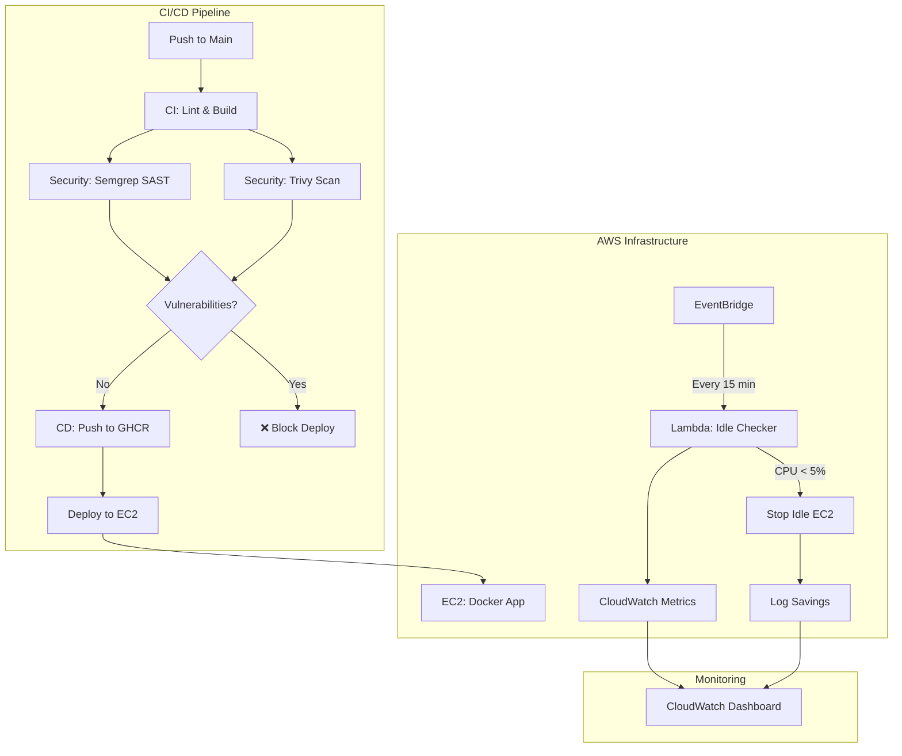

# 🛡️ Autonomous Cloud Guardian

> **A FinOps + DevSecOps Platform** — Automatically secures code and optimizes cloud costs

[](https://github.com/Anshul-exe/Autonomous-Cloud-Guardian/actions/workflows/ci.yml)
[](https://github.com/Anshul-exe/Autonomous-Cloud-Guardian/actions/workflows/security.yml)
[](https://github.com/Anshul-exe/Autonomous-Cloud-Guardian/actions/workflows/cd.yml)

---

## 📋 Overview

Autonomous Cloud Guardian demonstrates enterprise-grade DevSecOps and FinOps practices through a real-world implementation:

| Pillar             | Implementation                                                        |
| ------------------ | --------------------------------------------------------------------- |
| **DevSecOps**      | Automated SAST (Semgrep) + Container scanning (Trivy) in CI/CD        |
| **FinOps**         | Lambda-based idle resource detection, auto-stop, and savings tracking |
| **Infrastructure** | Terraform-managed AWS resources with least-privilege IAM              |
| **Observability**  | CloudWatch dashboards for cost and security metrics                   |

---

## 🏗️ Architecture



---

## 🔐 DevSecOps Pipeline

### Security Scanning Flow

```
┌─────────────┐     ┌─────────────┐     ┌─────────────┐
│   CI Build  │────▶│   Semgrep   │────▶│   Trivy     │
│  (Lint/Test)│     │   (SAST)    │     │ (Container) │
└─────────────┘     └─────────────┘     └─────────────┘
                           │                   │
                           ▼                   ▼
                    ┌─────────────────────────────┐
                    │   GitHub Security Tab       │
                    │   (SARIF Reports)           │
                    └─────────────────────────────┘
```

### Security Tools

| Tool          | Purpose                                    | Integration                                                                 |
| ------------- | ------------------------------------------ | --------------------------------------------------------------------------- |
| **Semgrep**   | Static Application Security Testing (SAST) | Custom rules in `.semgrep.yml` detecting `eval()`, `exec()`, code injection |
| **Trivy**     | Container vulnerability scanning           | Scans Docker image for CVEs in OS packages and dependencies                 |
| **ESLint**    | Code quality + security linting            | `eslint-plugin-security` for JS-specific vulnerabilities                    |
| **npm audit** | Dependency vulnerability check             | Blocks on HIGH severity issues                                              |

### Custom Semgrep Rules

```yaml
# Detects dangerous patterns
- eval(...) # Code injection
- exec(...) # Command injection
- new Function(...) # Dynamic code execution
```

---

## 💰 FinOps Automation

### Idle Resource Detection

```
┌──────────────────┐
│   EventBridge    │
│  (Every 15 min)  │
└────────┬─────────┘
         │
         ▼
┌──────────────────┐     ┌──────────────────┐
│  Lambda Function │────▶│ CloudWatch Metrics│
│  (Idle Checker)  │     │  (CPU Utilization)│
└────────┬─────────┘     └──────────────────┘
         │
         ▼
┌──────────────────┐
│  CPU < 5% for    │───Yes───▶ Stop Instance
│   30 minutes?    │           + Log Savings
└──────────────────┘
```

### How It Works

1. **EventBridge** triggers Lambda every 15 minutes
2. **Lambda** queries CloudWatch for CPU utilization metrics
3. Instances with `AutoStop: true` tag and avg CPU < 5% over 30 minutes are stopped
4. **Savings calculated** based on instance type hourly rate
5. **Dashboard** displays cumulative savings and actions

### Cost Optimization Features

- ✅ Auto-stop idle EC2 instances
- ✅ Tag-based targeting (opt-in via `AutoStop: true`)
- ✅ Savings tracking and reporting
- ✅ CloudWatch dashboard for visibility
- ✅ Slack notifications
- ✅ Grafana integration

---

## 🚀 Quick Start

### Prerequisites

- AWS CLI configured with credentials
- Terraform >= 1.0
- Docker
- Node.js 18+ (for local development)

### Deploy Infrastructure

```bash
# Clone repository
git clone https://github.com/Anshul-exe/Autonomous-Cloud-Guardian.git
cd Cloud-Guardian

# Generate SSH key pair
ssh-keygen -t rsa -b 4096 -f terraform/Cloud-Guardian.pem -N ""
mv terraform/Cloud-Guardian.pem.pub terraform/Cloud-Guardian.pub

# Deploy with Terraform
cd terraform
terraform init
terraform plan
terraform apply
```

### Run Locally

```bash
cd app
npm install
npm run dev
# API available at http://localhost:3000
```

### API Endpoints

| Endpoint      | Description                       |
| ------------- | --------------------------------- |
| `GET /`       | Application info                  |
| `GET /health` | Health check with uptime          |
| `GET /hello`  | Hello world                       |
| `GET /load`   | CPU load simulation (for testing) |

---

## 📁 Project Structure

```
Cloud-Guardian/
├── app/
│   ├── index.js              # Express.js API
│   ├── Dockerfile            # Multi-stage Docker build
│   └── package.json          # Dependencies
├── terraform/
│   ├── main.tf               # EC2, Security Groups
│   ├── variables.tf          # Configuration variables
│   └── outputs.tf            # Deployment outputs
├── .github/workflows/
│   ├── ci.yml                # Build & test pipeline
│   ├── security.yml          # Semgrep + Trivy scans
│   └── cd.yml                # Deploy to EC2
└── .semgrep.yml              # Custom security rules
```

---

## 🛠️ Technologies

### Infrastructure & Cloud


### CI/CD & Security


### Application


---

## 📊 Skills Demonstrated

| Category                   | Skills                                                                   |
| -------------------------- | ------------------------------------------------------------------------ |
| **Infrastructure as Code** | Terraform modules, state management, AWS provider                        |
| **CI/CD**                  | GitHub Actions, multi-stage pipelines, artifact management               |
| **DevSecOps**              | SAST integration, container scanning, SARIF reports, shift-left security |
| **FinOps**                 | Cost optimization automation, idle resource detection, savings tracking  |
| **Cloud Services**         | EC2, Lambda, CloudWatch, EventBridge, IAM, SSM Parameter Store           |
| **Containerization**       | Docker, GHCR, image scanning, multi-stage builds                         |
| **Serverless**             | Lambda functions, event-driven architecture                              |
| **Monitoring**             | CloudWatch dashboards, metrics, alarms                                   |

---

## 🔮 Roadmap

- [x] CI/CD Pipeline with GitHub Actions
- [x] Semgrep SAST integration
- [x] Trivy container scanning
- [x] Terraform-managed infrastructure
- [ ] Lambda idle EC2 stopper
- [ ] CloudWatch dashboard
- [ ] Savings tracker script
- [ ] Slack notifications
- [ ] Grafana dashboards
- [ ] Multi-region deployment

---
